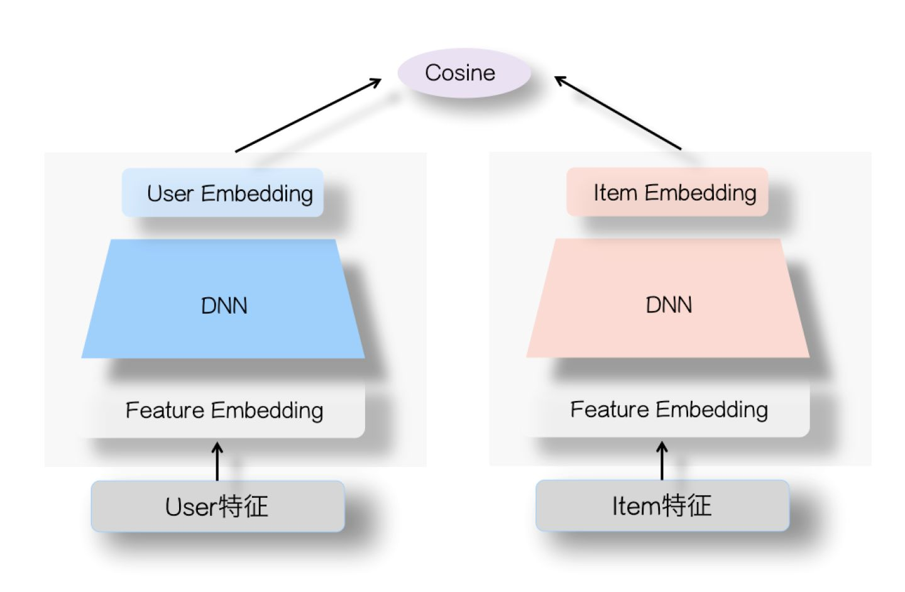

# 双塔模型 - DSSM

该项目实现了基于PyTorch和MovieLen 1M的DSSM模型及训练预测脚本，包括SENet和随机负采样。

## 1.DSSM基础理论

双塔模型最早是2013年微软提出来的 Learning Deep Structured Semantic Models for Web Search using Clickthrough Data，主要是来解决搜索过程中query词和doc之前的一个匹配问题，后来很多大厂沿用这个思路，将其应用到了推荐领域。

### 1.1 DSSM简介
DSSM(Deep Structured Semantic Models)，也叫**深度语义匹配模型**，文章的本意是用来进行语义相似度计算的。主要通过对用户输入的Query的历史和Documents进行embedding编码，使用余弦相似度计算用户query的embedding和documents的Embedding的相似程度，继而达到语义相似度计算的目的。

### 1.2 DSSM原理
众所周知，随着Deep Learning的发展，非常多的深度模型可以用来进行特征的交叉，从而表示各种各样的Embedding，而DSSM则是利用这一点，使用复杂的深度学习网络来构建Query侧的特征Embedding和documnets侧特征的Embedding，在线上预测的时候，通过计算两个语义Embedding的dot product距离或者cosine距离来表示当前query和当前document的相似度，而整体的这个模型就叫做语义相似模型。这个模型可以获得query，document，也就是语句的低维语义向量表达，还可以预测这两者之间的语义相似程度。

### 1.3 DSSM结构图


从上图来看，DSSM可以分为如下3个模块：输入层, DNN层，Similarity计算层。

1. **输入层**: 主要包含Term Vector和Word Hashing，主要是通过*字*的力度及n-gram的方式将Query和Document进行分词，形成一个30K维度的一个向量。注意：这里使用了Hashing的方式，但论文中作者也提到了使用Hashing会存在Hashing冲突的问题，但Word Hashing的方式冲突的概率比较小。
2. **DNN层**: 主要利用复杂的深度学习网络，即多层的MLP，来进行特征筛选和交叉，得到最后一层的Semantic Feature向量，用来表示当前这个塔所输出的语义信息。
3. **Similarity计算层**: 得到了各个塔的Embedding之后，就可以根据Embedding中的语义信息，通过dot product或者cosine distance进行距离的计算，来表示当前两个Embedding的相似程度。


## 2.推荐中的DSSM
### 2.1 架构
因为在推荐和广告领域，实际上也是进行了相似度匹配，匹配的不再是query和documents，而是用户和物料的信息，来将用户和物料进行相似度匹配，即具有与用户相似度越高的物料，越容易被该用户点击。从结构上来看，DSSM也刚好可以满足推荐和广告的这个相似度匹配的需求。

推荐的模型结构图如下：




跟原始的query和doc的DSSM不同主要在**输入层**。

推荐中输入的是用户和物料的一些类别型数值型特征等，所以在推荐领域中，将DSSM中的Word Hashing的方法替换成了Embedding来进行输入数据的处理，随后将拼接好的Embedding喂入多层MLP中获得用户和物料的表征信息，最后通过dot product或者cosine相似度来计算用户和物料的匹配程度。

### 2.2 DSSM召回
在很多的推荐场景中，很多厂都比较青睐使用DSSM来做召回，那DSSM如何来做召回呢？

我们都知道DSSM可以生成用户的Embedding和物料的Embedding，通过相似度计算方法来计算用户和物料的匹配程度。那其实就很简单，有两种方式进行：

1. **方法1**：将全部的用户Embedding和全部物料的Embedding保存下来，比如k-v数据库，annoy，faiss等。通过相似度距离的计算，拿到匹配度最高的topK，作为这一次的召回结果。
2. **方法2**：将全部物料的Embedding保存下来，到了线上之后，用户请求过来之后，将用户的特征拿到喂入user塔进行实时预估，拿到用户的最新的Embedding，然后将该Embedding和之前保存的Item的Embedding集合做一次向量相似度计算，拿到topK结果，作为召回结果。
 
**方法2** 相比较 **方法1** 的好处是：用户的Embedding是实时生成的，适合存在用户特征实时变化的情况，比如存在用户的行为序列等。

那为什么物料的不能实时生成呢？ -- 当然，如果数据量不大的情况下，实时生成一定会比离线生成要好。但因为一般物料都是按照百万或者千万甚至电商的都是百亿级别的数据，而每次请求是要从这些成百亿的数据中找到topK的数据，如果全部走一遍的话，会大大降低性能。所以就相当于用损失掉一部分效果来满足性能的需求。

## 3.DSSM的优缺点
每个事务其实都是一个矛盾体。

双塔模型最大的特点就是"双塔分离"。在"部署时分离"成了双塔模型比较大的优点，而在"训练时分离"成了制约双塔性能的最大因素。 -- 来自石塔西《久别重逢话双塔》

### 3.1 优点
1. 两个塔在预测的时候互不干扰，所以对于百亿级别的物料可以进行周期性，批量的离线生成Embedding，大大减轻了serving的压力。
2. 相比较Graph Embedding, item2vec，DSSM是有监督的学习，且具有一定的特征处理能力，减少了一定的误差。
3. 因为使用到了DNN，所以减少了一定程度的人工特征交叉。

### 3.2 缺点
1. 因为训练的时候要保证预测时双塔的分离，所以一些用户和物料的交叉特征没有地方处理。
2. 通过DNN生成的Embedding都是高度浓缩的，且该模型只有一次交叉的机会，所以在交叉的时候，一些细节信息已经损失，永远失去了与对侧信息交叉的机会，造成模型一定程度上的性能损失。
3. 线上只能使用简单的相似度计算，无法使用一些复杂的交叉结构，比如目标Item对用户行为序列的Attention等。

## 4. DSSM改进

从上面介绍的来看，DSSM比较突出的一个缺点就是用户和物料特征的交叉只能在最后计算相似度的时候进行，但实际上经过DNN的Embedding已经是浓缩过的，有些细节的信息已经在DNN的过程中被丢弃掉了，永远的时区了与对侧信息交叉的机会。所以沿着这个缺点，可以对DSSM进行一步改进：想方设法保留更多的信息到最后的Embedding中，从而让这些细节性的信息可以跟对侧的塔进行交叉。

### 4.1 SENet

SENet由自动驾驶公司Momenta在2017年提出，在当时，是一种应用于图像处理的新型网络结构。基于CNN的网络，通过针对特征Channel之间的相关性进行建模，对重要的特征进行强化来提升模型的准确率，个人认为实际上是针对CNN中的Channel进行过了一个简单的Attention操作。


SENet主要分为两个步骤：Squeeze和Excitation两个步骤。

1. Squeeze将 H\*W\*C Global pooling到1\*1\*C的维度.
2. Excitation通过两层的FC来提取每个Channel的重要程度。

具体的操作如下，以Inception为例：


SENet将Inception中得到的H\*W\*C首先先经过Golbal pooling将原来的维度压缩成1\*1\*C，然后经过第一个FC将Channel维度降低到C/r，r表示一个Hyper-Parameter，然后再经过一个FC后将Channel维度恢复到C，最后经过一个sigmoid对每个Channel的重要性进行归一来得到最终的每个Channel的重要性权重，最后再将Channel跟权重进行Channel-wise得到最终的特征向量。

#### 4.1.1 SENet在推荐上的应用

SENet可以提取图片中Channel的重要性权重，那是不是可以放在推荐上来提取喂入模型的特征的重要性呢？答案是可以的。

**Squeeze**: 在该阶段对每个特征的Embedding进行数据的压缩和汇总。具体做法如下：

针对每个特征的Embedding，进行average pooling，这个数值当成Embedding对应的数据压缩后的表征，也就是说，把第i个特征的Embedding里面的Embedding信息表征压缩到了一个数值中。

- 问：Average Pooling能否换成Max Pooling（原版SENet是使用的Max Pooling）？可以，但Average Pooling或者Sum Pooling从理论上来说会更好。因为图像领域的求Max pooling表示需要找到最强的那个Channel信息，类似于寻找轮廓的边界，而推荐领域的Embedding，每一位的数字应该都是有意义的，所以Average Pooling和Sum Pooling可以更好的保留信息。

**Excitation**: 在该阶段，通过两层MLP+sigmoid来对特征重要性权重进行提取。具体做法如下：

第一层MLP的作用是在做特征交叉，相当于通过FC，来动态的判断哪些特征重要，哪些特征不重要。
第二层MLP的作为是恢复原来输入的大小维度。
sigmoid用来归一化每个特征的重要性。

具体的结构如下：


相当于在用户塔和物料塔的在特征Embedding层上，各自加入一个SENet模块就行了，两个SENet各自对User侧和Item侧的特征，进行动态权重调整，强化那些重要特征，弱化甚至清除掉（如果权重为0的话）不重要甚至是噪音的特征。其余部分和标准双塔模型是一样的。

## 5 样本采样
相比较粗排精排使用曝光点击作为正样本，曝光未点击作为负样本，召回阶段的样本选择更为重要。"如果说排序是特征的艺术，那么召回就是样本的艺术，特别是负样本的艺术 。样本选择错了，那么无论多么牛逼的模型设计、特征工程，只能是南辕北辙，做得越卖力，错得越离谱。" --来自知乎《负样本为王：评Facebook的向量化召回算法》

为什么召回阶段不能使用曝光未点击作为负样本呢？

机器学习中比较重要的一条准则是：**离线训练数据的分布，应该与线上实际应用的数据，保持一致。**

如果使用曝光未点击的作为负样本，就相当于离线数据是已经通过一层过滤（其他召回）进行过滤后的数据，与线上实际的数据分布差异会比较大，也就违反了刚才所说的准则。

引用《负样本为王：评Facebook的向量化召回算法》中对召回和排序的介绍：

- 排序其目标是“从用户可能喜欢的当中挑选出用户最喜欢的”，是为了优中选优。与召回相比，排序面对的数据环境，简直就是 温室里的花朵。  
- 召回是“是将用户可能喜欢的，和海量对用户根本不靠谱的，分隔开”，所以召回在线上所面对的数据环境，就是 鱼龙混杂、良莠不齐。

**那召回模型的负样本采样怎么来做呢？**

召回的负样本采样主要包含两个方面：

1. **easy negative**：匹配度最低的，能被一眼看穿，难度并不大的，叫easy negative。大部分的easy negative主要是随机负采样，从全部物料中随机抽取样本作为负样本，这样保证了离线训练的数据分布基本等同于线上实际应用的数据分布。
2. **hard negative**：匹配度适中的，能够增加模型在训练时的难度，让模型能够关注细节，叫hard negative。hard negative有多种方式实现，可以从召回精排中排名中间的一部分，即没有那么相似的，当成hard negative，用来开拓模型的眼界。还有像AirBnb中，通过地域的相似性来找负样本，相当于通过一些先验的知识来寻找hard negative。

## 6. DSSM使用方式

### 6.1 样本及采样

本次实验使用的是Movie-len 1M的数据集，下载方式如下：

data_process文件夹下的movie_len中的data_download.py用户下载MovieLen 1M数据集，data_processing.py用于分割整合特征及Label，并划分train，val，test集合。
```shell
python data_download.py
python data_processing.py
```

采样方式：在main.py中有一个参数为neg_sampling，若大于0，则进行样本负采样，采样数为 **正样本数量\*neg_sampling.

### 6.2 DSSM使用方式

***训练方式***
```shell
python main.py --data_path dataset/ml-1m/feature --model_path checkpont --whether_train train --epochs 10 --batch_size 2048
    --dropout 0.0 --lr 0.001 --optimizer Adam --device gpu --encode_min 0.0 --neg_sampling 5 --use_senet True
```

***测试方式***  
whether_train修改为test即可。

data_path: 数据存放的位置  
model_path: 模型存放的位置  
whether_train: 当前为训练train还是测试test  
epochs: 训练的轮数  
batch_size: 样本batch的数量  
dropout: 模型神经元dropout的占比  
lr: 学习率  
optimizer: 优化器  
device: 训练预测所使用的设备  
encode_min: 按照出现概率进行特征的Mapping  
neg_sampling: 负样本采样的数量  
use_senet: 是否使用SENet  

目前也封装了DSSM的训练预测class，

***a. 定义对象及初始化***
```python
trainable = DSSMTrainable(
    x, y, cols_params=None, batch_size=2048, shuffle=True, val_x=None, val_y=None,
    label_encoder_rate_min=0.0001, user_dnn_size=(64, 32), item_dnn_size=(64, 32), dropout=0.2,
    activation='LeakyReLU', model_path=None, use_senet=False, device='cpu')
```
参数意义：
1. x: 传入的训练或者预测的特征参数，type为DataFrame。
2. y: 传入的训练或者预测的Label, type为DataFrame。
3. cols_params: 特征的列信息，type为Dict。如果是训练过程的话，必填，非训练过程不填
Example：
```
col_params = {
    'user_age': {
        'belongs': 'user', # 属于哪个塔，如果是双塔的话，必填
        'use_vec': True,  # 当前这个特征是否为向量，非必填，默认False
        'vec_len': '128'  # 向量的长度，非必填，只要在use_vec为True生效
    }
}
```
4. batch_size: 训练时的batch_size, 默认2048
5. shuffle: 是否shuffle, 默认True
6. val_x: 验证集，同x, 默认为None，则没有验证集
7. val_y: 验证集的Label, 同y, 默认为None，则没有验证集Label
8. label_encoder_rate_min: 做特征清洗时按照出现的概率进行抛弃，0.0时不抛弃任何出现的值，0.0001时抛弃掉出现概率小于0.0001的值。
9. user_dnn_size: 用户塔的层数及神经元个数。
10. item_dnn_size: Item塔的层数及神经元个数。
11. dropout: 是否使用Dropout及Dropout的比例。
12. activation: dnn中用到的激活函数
13. model_path: 测试的时候使用，表示model和datatype存放的目录，train过程可以不填。
14. use_senet: 是否使用SENet Block.
15. device: 模型的device

***b. 训练***
```
auc = trainable.train(
    epochs=10, val_step=1, device='cpu', optimizer='Adam', lr=1e-5, model_path=None,
    lr_decay_rate=0, lr_decay_step=0)
```
传入参数含义：
1. epochs：训练的轮数，默认10个Epoch
2. val_step: 每隔几个epoch进行一次val，仅在x_val和y_val不为None时生效。
3. device: 在哪里训练，默认cpu训练
4. optimizer: 优化器，默认Adam
5. lr: Learning Rate学习率，默认1e-5。
6. model_path: 在x_val和y_val不为None时生效，将会保存AUC最好的权重信息。
7. lr_decay_rate: 学习率衰减概率
8. lr_decay_step: 学习率衰减的step

返回参数含义：
1. auc: 为当前训练轮数过后的auc值

***c. 测试***
```
auc = trainable.test(self, device='cpu'):
```
因为测试时使用的也是Trainable的对象，所以Train和Test不能同时进行。
传入参数含义：
1. device: 在哪里预测，默认cpu

返回参数含义：
1. auc: 为当前训练轮数过后的auc值

***d. 保存模型***
```
trainable.save_model(model_path)
```
传入参数含义：
1. model_path: 保存模型的地址

### 6.3 DSSM在MovieLen1M的效果

Test AUC: 0.73

## 7. TODO
1. 行为序列的建模，比如self-attention等。
2. 模型结构修改，类似并联双塔。

## Reference
1. [Learning Deep Structured Semantic Models for Web Search using Clickthrough Data](https://www.microsoft.com/en-us/research/publication/learning-deep-structured-semantic-models-for-web-search-using-clickthrough-data/)
2. [久别重逢话双塔](https://zhuanlan.zhihu.com/p/428396126)
3. [双塔模型DSSM及各种变体塔](https://zhuanlan.zhihu.com/p/358781457)
4. [DSSM双塔模型系列一双塔模型召回](http://yougth.top/2020/12/07/DSSM%E5%8F%8C%E5%A1%94%E6%A8%A1%E5%9E%8B%E7%B3%BB%E5%88%97%E4%B8%80/)
5. [Squeeze-and-Excitation Networks](https://arxiv.org/pdf/1709.01507.pdf)
6. [SENet双塔模型：在推荐领域召回粗排的应用及其它](https://zhuanlan.zhihu.com/p/358779957)
7. [“并联”双塔模型 | 你还不知道怎么玩吗！](https://mp.weixin.qq.com/s/karPWLyHITu-qZceEhpn-w)
